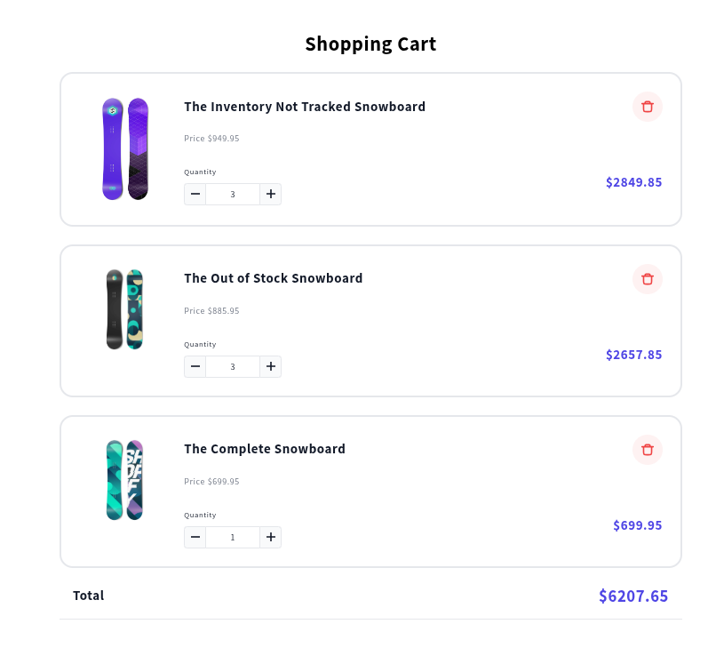

# Shopify App Template - Extension only

This is a template for building an [extension-only Shopify app](https://shopify.dev/docs/apps/build/app-extensions/build-extension-only-app). It contains the basics for building a Shopify app that uses only app extensions.

This template doesn't include a server or the ability to embed a page in the Shopify Admin. If you want either of these capabilities, choose the [Remix app template](https://github.com/Shopify/shopify-app-template-remix) instead.

Whether you choose to use this template or another one, you can use your preferred package manager and the Shopify CLI with [these steps](#installing-the-template).

## Benefits

Shopify apps are built on a variety of Shopify tools to create a great merchant experience. The [create an app](https://shopify.dev/docs/apps/getting-started/create) tutorial in our developer documentation will guide you through creating a Shopify app.

This app template does little more than install the CLI and scaffold a repository.

## Getting started

### Requirements

1. You must [download and install Node.js](https://nodejs.org/en/download/) if you don't already have it.
2. You must [create a Shopify partner account](https://partners.shopify.com/signup) if you don’t have one.
3. You must create a store for testing if you don't have one, either a [development store](https://help.shopify.com/en/partners/dashboard/development-stores#create-a-development-store) or a [Shopify Plus sandbox store](https://help.shopify.com/en/partners/dashboard/managing-stores/plus-sandbox-store).
4. You must enable the [Headless app](https://apps.shopify.com/headless) to use a Storefront API public key
5. You can enable the [Shopify GraphiQL app](https://shopify-graphiql-app.shopifycloud.com/login) to use an useful GraphQL explorer, **product_listings:read** scopes is required for Storefront API
6. This application requires to have enabled the next **scope: read_products**

### Installing the template

This template can be installed using your preferred package manager:

Using yarn:

```shell
yarn create @shopify/app
```

Using npm:

```shell
npm init @shopify/app@latest
```

Using pnpm:

```shell
pnpm create @shopify/app@latest
```

This will clone the template and install the required dependencies.

#### Local Development

[The Shopify CLI](https://shopify.dev/docs/apps/tools/cli) connects to an app in your Partners dashboard. It provides environment variables and runs commands in parallel.

You can develop locally using your preferred package manager. Run one of the following commands from the root of your app.

Using yarn:

```shell
yarn dev
```

Using npm:

```shell
npm run dev
```

Using pnpm:

```shell
pnpm run dev
```

Open the URL generated in your console. Once you grant permission to the app, you can start development (such as generating extensions).

## Instructions

This Shopify stack uses the next stack:
- Liquid: to add the base markup
- Tailwind CSS framework, basic intallation for now
- React: to build the Cart component
- GraphQL: to query the existing products from Shopify

## Demo

Demo page was added:
[https://shocoor.myshopify.com/blogs/news/demo-shopping-cart](https://shocoor.myshopify.com/blogs/news/demo-shopping-cart)


## Developer resources

- [Introduction to Shopify apps](https://shopify.dev/docs/apps/getting-started)
- [App extensions](https://shopify.dev/docs/apps/build/app-extensions)
- [Extension only apps](https://shopify.dev/docs/apps/build/app-extensions/build-extension-only-app)
- [Shopify CLI](https://shopify.dev/docs/apps/tools/cli)

